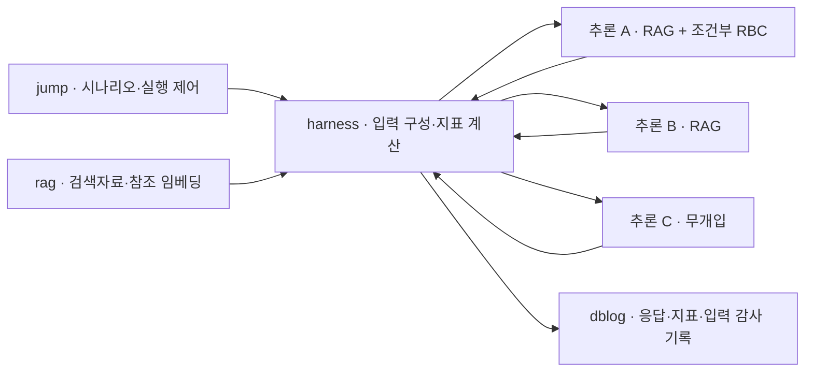

# LACP 실험 자료 · 재현 저장소

**논문 독자가 실험의 설정, 응답, 실제 입력, 지표 계산과 결과표를 확인하기 위한 연구 자료입니다.**

이 저장소는 「공공부문 생성형AI의 일관성과 책임성확보를 위한 운영체계 연구」 국문 REV9(2026-09-29)와 기술 원고 `LACP_FINAL_0927_REV2`의 근거가 된 기존 LACP 실험을 다룹니다. LACP의 영문 확장명이나 모델의 정확한 가중치 버전을 추정해 덧붙이지 않습니다. 원고 전체를 대신하는 자료가 아니라, 주장과 관측을 추적할 수 있는 증빙 저장소입니다.

**공개 버전:** [`v2026.09.29`](https://github.com/morophi/lacp-reproducibility/releases/tag/v2026.09.29) · **원자료 수집:** 2026-09-29 · **실험:** 2026년 6월 · **분석 대상:** 정식 채택 80회, 7,200응답. 새 LLM 생성 실험은 수행하지 않았습니다.

## 처음 방문한 독자에게

| 확인하려는 내용 | 먼저 볼 자료 |
|---|---|
| 어떤 조건을 비교했는가 | [실험 설계와 실행 조건](docs/experiment.md) |
| 논문 표·주장의 원자료는 무엇인가 | [논문–자료–코드 대응표](docs/paper-map.md) |
| 지표가 실제로 무엇을 계산하는가 | [지표 정의와 산식](docs/metrics.md), [실제 지표 코드](src/harness/metrics.py) |
| 결과표를 내 컴퓨터에서 다시 계산하고 싶다 | [재현 안내](docs/reproduction.md) |
| 실제 응답·입력·통제문구를 보고 싶다 | [실행 경로 대조](docs/execution-traces.md), [25턴 응답](results/reference/turn25_responses_and_components.csv) |
| 자료의 출처와 공개 과정이 궁금하다 | [출처와 공개 처리](docs/provenance.md), [파일별 해시](provenance/artifacts.json) |
| 어떤 주장을 할 수 없나 | [검증 범위와 한계](docs/limitations.md) |

## 연구가 관측한 것

고정된 복지행정 상담 시나리오 30턴을 세 경로 A·B·C에서 반복했습니다. 주 실험 Run B에서 A는 질문별 검색자료(RAG)와 조건부 책임경계 통제(RBC), B는 같은 검색자료, C는 두 개입이 없는 경로입니다. RBC는 `SC-Protocol`이라는 결정적 프롬프트 정책으로 구현되어 있으며, 다수결 기반 self-consistency 기법을 뜻하지 않습니다.

실험은 표현·응답 구조·참조 거리 및 실행 경로를 관측합니다. **응답의 정책적 정확성, 실제 시민의 결과, 조직설계의 효과를 검증한 실험은 아닙니다.** 저장된 모델 응답에는 잘못된 제도 안내가 포함될 수 있으며 실제 민원 안내로 사용해서는 안 됩니다.

### 분석 분모

| 구분 | 채택 실행 | 응답 행 | 용도 |
|---|---:|---:|---|
| CR | 10 | 900 | 초기 기록·점검 |
| CR2 | 5 | 450 | 임계값 재구성 |
| Run B | 30 | 2,700 | 주 분석, 국문 표 3·4 |
| CF-A–E | 각 5, 합계 25 | 2,250 | 조건별 진단 비교 |
| CF-F | 10 | 900 | 지정 턴의 결합 개입 및 다른 공통 언어 지시 |
| **전체 정식 채택** | **80** | **7,200** | 지표·입력·실행 경로 재현 |

최종 DB에는 **96회·8,568응답**을 보존합니다. 분석은 `run_mode == "formal"` 및 `acceptance_status == "accepted"`를 모두 만족하는 실행만 선택합니다. failed CR 1회, accepted smoke CR2 1회, rejected Run B 13회, pending TR 1회는 주 분석에서 제외합니다. 전체 DB를 공개해 제외 내역도 확인할 수 있습니다.

## 실험 시스템과 수집 범위



그림은 Run B의 역할을 보여 줍니다. CF에서는 배정이 달라집니다. 이번 수집은 `jump`, `harness`, `rag`, `dblog`의 **컨트롤 노드 4개만** 대상으로 했으며 추론 노드에는 접속하지 않았습니다.

| 컨트롤 노드 | 공개 내용 |
|---|---|
| jump | 시나리오, 실행·검증 로직, 실행 스크립트 |
| harness | 프롬프트 구성, 정책·트리거, 지표 구현, 설정, 단위 검증 코드 |
| rag | 12,240개 청크, 12,240×384 원천 임베딩, CDS 참조, 적재 코드 |
| dblog | 최종 DB 6개 테이블, 실제 스키마, 정식 채택 80개 실행 로그 |

## 빠른 재현

Python 3.12 환경에서 다음 명령을 실행합니다. 기본 재현에는 GPU, 실험 서버 접속, DB 서버, 생성 모델 또는 임베딩 모델 다운로드가 필요하지 않습니다. 의존성 설치에는 패키지 저장소 연결이 필요합니다.

```bash
git clone https://github.com/morophi/lacp-reproducibility.git
cd lacp-reproducibility
git checkout v2026.09.29
python3 -m venv .venv
source .venv/bin/activate
python -m pip install -r requirements-analysis.txt
python analysis/reproduce.py
```

마지막에 `PASS: offline reproduction completed`가 출력됩니다. 압축 해제 자료는 `build/`, 이번 실행 결과는 `results/reproduced/`에 만들어지며 저장소의 원자료를 덮어쓰지 않습니다. 저장소와 압축 해제·결과를 위해 약 1GB 이상의 여유 공간을 확보하십시오.

기본 재현에서 확인하는 항목은 다음과 같습니다.

- 원자료 공개 파일의 SHA-256 및 압축 해제 내용의 SHA-256
- 논문 주요 대비·턴별 대비·CF 대비 등 **7개 기준 결과표**
- MA·SRR·SCI 원문 계산 및 저장 배열에 근거한 LMS 집계 **7,200행**
- 시나리오·검색 청크·정책문구·최근 3턴 이력으로 구성한 입력 해시 **7,200행**
- Run B 트리거 적용·사유·출처 노드 **900회 판단**, 적용 **90건**
- 원천 임베딩으로 재생성한 CDS 참조 벡터의 값과 파일 해시
- CF-C/E 통제문구와 Run B 6회차 응답·입력 차이

**CDS 응답 임베딩의 기본 검증은 9월 27일 모델 재계산 기록과의 대조입니다.** 기본 명령이 임베딩 모델을 새로 실행했다고 해석하면 안 됩니다. 원천 임베딩에서 참조 벡터를 새로 만드는 단계와 응답을 다시 임베딩하는 단계는 [재현 안내](docs/reproduction.md)에서 구분합니다.

## 핵심 결과를 바로 보기

국문 표 3에 대응하는 아래 값은 Run B의 실행·턴별 짝 비교 평균입니다. CDS만 참조 거리가 작아지는 방향으로 부호를 뒤집었습니다. LMS·MA·SRR·SCI는 표기 순서의 차이입니다.

| 대비 | 응답쌍 | LMS | 역방향 CDS | MA 확정 | SRR | SCI |
|---|---:|---:|---:|---:|---:|---:|
| A−B RBC 적용 턴 | 90 | −0.0327 | +0.0308 | −0.1222 | −0.0037 | −0.0449 |
| A−B 비적용 턴 | 810 | −0.0461 | −0.0028 | −0.0102 | −0.0372 | −0.0608 |
| B−C 전 턴 | 900 | −0.0385 | −0.0186 | +0.3083 | −0.1972 | −0.1028 |
| A−C 전 턴 | 900 | −0.0832 | −0.0181 | +0.2869 | −0.2311 | −0.1619 |

정밀값: [main_contrasts.csv](results/reference/main_contrasts.csv). 서로 다른 분모의 대비를 개입 효과 순위로 해석하지 않습니다. 동일한 질문의 반복이며 독립 민원사례 2,700건이 아닙니다.

Run B에서 최빈 응답과 같은 행은 2,675/2,700(**99.074%**)입니다. 다른 25행은 모두 6회차 Node A의 6–30턴에 집중됩니다. 이 비율은 정확도나 사고 확률이 아닙니다. 6턴은 기록된 입력 해시가 같으면서 응답이 달랐고, 7–30턴은 입력 해시도 달랐습니다. [실행 경로 증빙](results/published/path_trace_summary.json)을 참고하십시오.

## 파일 구성

```text
analysis/              독자용 오프라인 재현·대조 프로그램
data/db/               최종 DB 6개 CSV의 gzip 사본
data/logs/formal/      정식 채택 80회 실행 로그의 gzip 사본
data/rag/              청크·메타데이터·원천 임베딩·145개 검색 원문
src/harness/           실제 노드 구현과 설정
src/harness/historical/ 과거 실험 설정·프롬프트의 검증용 증거 파일
src/jump/              실행 제어·시나리오
src/rag/               참조 생성·적재 코드
src/dblog/             DB 스키마·추출 코드
results/reference/     기존 논문 재분석의 기준 결과표
results/published/     이번 공개본으로 재실행한 검증 결과
evidence/audit_20260927/ 이전 전수 검증의 상세 증거
provenance/            수집 시점·원본/공개본 해시·전체 파일 체크섬
docs/                  실험·지표·재현·출처·한계 설명
```

`historical/`은 **새 공개본의 재현 증거**입니다. 이전 GitHub 커밋 이력을 보존하는 브랜치나 태그가 아닙니다. 특히 CF-F 이전 프롬프트와 설정 해시 연결에 필요합니다.

## 공개 처리와 검증의 경계

- 기존 GitHub 이력과 연결되지 않는 새 최초 커밋에서 시작합니다.
- 로컬 비밀번호 파일·SSH 키·브라우저 자격 증명·환경 파일·가상환경·생성 모델 가중치는 포함하지 않습니다.
- 운영 주소는 `harness`, `rag`, `dblog`, `inference-a/b/c` 등 역할 이름으로 치환합니다. 따라서 일부 공개 파일은 노드 원본과 바이트 단위로 다릅니다. [출처 기록](provenance/artifacts.json)에 그 차이를 명시합니다.
- 수치·응답·과학적 입력 해시는 보존하며, 공개본에서 전수 재현을 실행했습니다.
- 당시 생성 모델 digest, 전체 배포 버전 식별자, 원시 토큰 후보 점수 전체는 확보되지 않았습니다. 현행 코드만으로 당시 모든 환경이 동일했다고 주장하지 않습니다.
- CF-F에는 공통 한국어 전용 지시가 추가되었습니다. 앞선 조건과 동일한 공통 프롬프트를 사용한 단일 요인 비교가 아닙니다.
- 노드에 남은 옛 운영 단위테스트는 50개 통과·5개 실패입니다. [불일치 항목과 이유](docs/archived-tests.md)를 공개하며, 논문 자료의 전수 재현 통과와 구분합니다.

## 인용과 이용

논문에는 저장소 주소와 **릴리스 `v2026.09.29` 및 해당 커밋**을 함께 적으십시오. 가변적인 `main`만 인용하지 않는 것이 좋습니다. [인용 안내](docs/citation.md)와 [자료별 권리 안내](RIGHTS.md)를 확인하십시오. 이 저장소는 DOI를 발급받았다는 주장을 하지 않습니다.

문제 제보 시 파일 경로, 릴리스, 실행한 재현 단계와 결과를 포함하면 검토가 쉽습니다. 인증정보와 실제 민원인의 개인정보는 첨부하지 마십시오.
